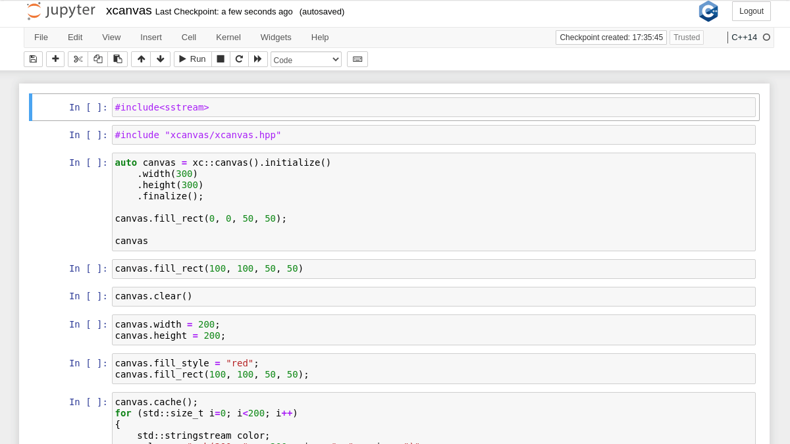

# xcanvas: The HTML 2D Canvas API brought to xeus-cling

## Documentation

There is currently no documentation for xcanvas, though you can look at the [ipycanvas documentation](https://ipycanvas.readthedocs.io) as xcanvas aims at providing the same API. You can also find an [example notebook on the repo](https://github.com/martinRenou/xcanvas/blob/master/examples/xcanvas.ipynb).

Note that xcanvas does not (yet) provide the full implemtation that ipycanvas provides.

## Installation

### From conda

```bash
conda install xeus-cling xcanvas -c conda-forge
```

### From sources (using conda)

First install dependencies (here using conda):

```bash
conda install cmake xwidgets xeus xeus-cling ipycanvas -c conda-forge
```

Then compile:

```bash
mkdir build
cd build
cmake -D CMAKE_INSTALL_PREFIX=$CONDA_PREFIX
make install
```

## Showcase


